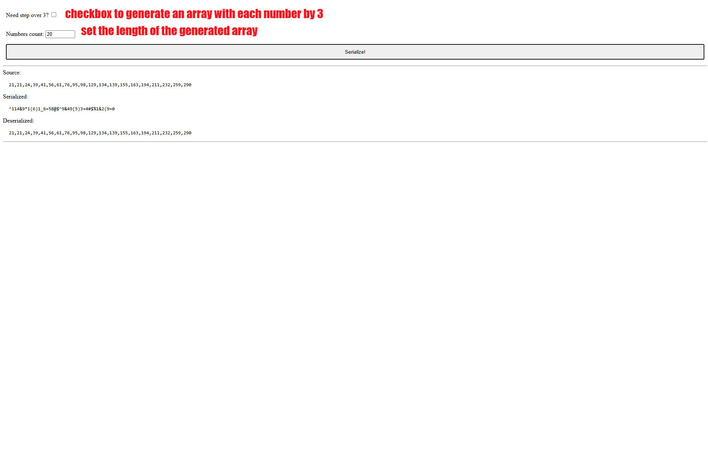
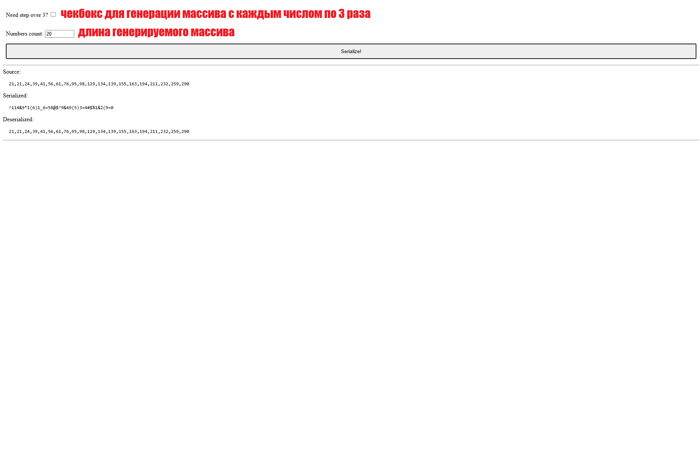

# Serializing an array of numbers with a range 1-300

## Install

```
npm i
```

## Tests

```
npm run tests
```

## Run

```
npm run start
```

## Web app

Web app running at http://localhost:9000/



##

# Сериализация массива с числами диапазона 1-300

## Установка

```
npm i
```

## Запуск тестов

```
npm run tests
```

## Запуск приложения

```
npm run start
```

## Веб приложение

Приложение будет запущено на http://localhost:9000/

